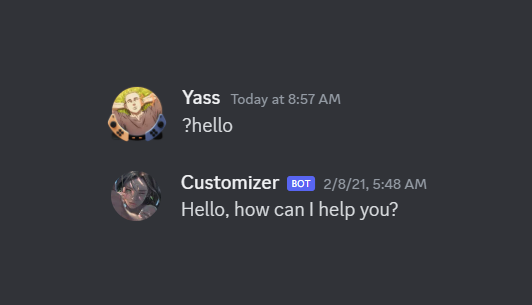

# Discord Bot

This was my first experience coding a discord bot, so I enjoyed learning about it. I was quite surprised of how many possibilities there were when I started coding this bot. I used `NodeJs` and `Discord.js` to create this bot.

### [Commands](https://github.com/DYasser/DiscordBot/tree/master/commands):  
- [**choose:**](https://github.com/DYasser/DiscordBot/blob/master/commands/choose.js) helps the user to choose between many choices.
- [**goodmorning**](https://github.com/DYasser/DiscordBot/blob/master/commands/goodmorning.js)/ [**goodnight:**](https://github.com/DYasser/DiscordBot/blob/master/commands/goodnight.js) puts the bot on an awake/ sleep state respectively. (*Sleep state stops all other commands from working until the bot wakes up*)
- [**hello:**](https://github.com/DYasser/DiscordBot/blob/master/commands/hello.js) greets the user randomly from the 5 greetings provided.
- [**help:**](https://github.com/DYasser/DiscordBot/blob/master/commands/help.js) shows all the commands using the an iteration that goes through all the .js files in the commands folder.
- [**request:**](https://github.com/DYasser/DiscordBot/blob/master/commands/request.js) used to give a request of a certain command that the bot needs or lacks.
- [**list:**](https://github.com/DYasser/DiscordBot/blob/master/commands/list.js) lists all the requests.
- [**meme:**](https://github.com/DYasser/DiscordBot/blob/master/commands/meme.js) grabs a meme from the reddit r/memes.
- [**reddit:**](https://github.com/DYasser/DiscordBot/blob/master/commands/reddit.js) grabs a photo from any reddit stated.
- [**pingtest:**](https://github.com/DYasser/DiscordBot/blob/master/commands/pingtest.js) tests the ping of the user.
- [**ping:**](https://github.com/DYasser/DiscordBot/blob/master/commands/ping.js) pong.

I have added a folder api that I intended to use for all needed routes to have an optimized program.
 
### Heroku:
I used Heroku to host my bot to have it always connected. I also used their server to host my `MySql` database that I used in some functions.

## How to run it

First of all, you need to have [`NodeJs`](!https://github.com/nodejs/node) set up in your machine. You can find everything needed in the GitHub link I shared.

To get started you can `git clone  https://github.com/DYasser/DiscordBot.git` and have `NodeJs` installed and initialized as I said earlier. You can run the file then by using the command `npm start` on any command line interpreter in the main folder.

## Coding process

I started creating this project just like any `NodeJs` project by initializing the project using `npm init` then started coding on the `main.js` file.

I first started by importing all the libraries I needed such as [`Discord.js`](!https://github.com/discordjs/discord.js/), [`express`](!https://github.com/expressjs/express), [`fs`](!https://github.com/nodejs/node/blob/master/doc/api/fs.md), and other really useful ones. I then set up the database using the `mysql` library. 

After setting up all the above, I am then able to start coding my Discord Bot. I start by setting up a prefix that the user is going to use. In this case, I chose `?` as a prefix.

```javascript
const prefix = '?';
```

I then used the code below to make the program understand first where the commands are situated, then the set of command name and command code.

```javascript
const commandFiles = fs.readdirSync('./commands/').filter( file => file.endsWith('.js'));
for(const file of commandFiles){
    const command = require(`./commands/${file}`);

    client.commands.set(command.name, command);
}
```

I then set up each command by prompting the program when it reads a message starting with the selected prefix. I then take the command, remove the prefix, and change it to lower case to be able to be able to let the user use the commands as they want and not make it harder for them to use the bot. 

```javascript
client.on('message', message => {
  if(!message.content.startsWith(prefix) || message.author.bot) return;

  const args = message.content.slice(prefix.length).split(/ +/);
  const command = args.shift();//.toLowerCase();
  [...]
}
```

Since there are lots of commands here I will show only a few, but feel free to go through the code in details in case you saw any interesting command.

I stored all the commands in a file to be able to go through them easily using for loops in the code. 
Before I start explaining some complex commands, I will present you this simple one to understand the structure of each command.

```javascript
module.exports = {
  name: 'ping',
  description: 'pong',
  type: 'fun',
  execute(message, args){
      message.channel.send("pong!");
  }
}
```
All the commands are coded in the same way to be able to retrieve any information easily. Each command has a `name`, a `description` that would be used in the help command, a `type` for the same reason, and finaly the command that is directly executed. In this case, the executiong program is really simple, it just prompts the program to send a message in the chat **"pong!"**



Another command that I would like to present is the request command that allows the user to submit a request of a command to the database that I would be able to view. 

```javascript
module.exports = {
    name: 'request',
    description: 'Request a command to my creator',
    type: 'utility',
    execute(message, args, connection){
        const member = message.member;
        let username = member.user.username;

        let msg = message.content.split(" ");

        msg.shift();
        let command = msg[0];

        msg.shift();
        let description = msg.join(" ", msg); 

        connection.query(`
        INSERT INTO requests(username, commandName, description) 
        VALUES ( "`+ username +`",
            "`+ command +`",
            "`+ description +`")`)

        message.channel.send("Command name: " + command+ "\nDescription: " + description + "\nsent by "+`${member}`+"!");
    }
}
```

The message is being split to be then used inside an SQL command that would be used to insert each value inside the table.

That is it for my Discord bot presentation, I learned a lot from this and got to use my `javascript` skills.

>           this is the end of my documentation
